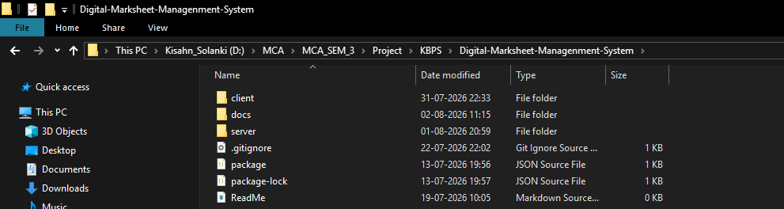

# Digital Marksheet Management System (DMMS)

> A modern, secure, and role-based School ERP System for managing academic records, examinations, and digital marksheets.

---

# 1. Project Overview

The **Digital Marksheet Management System (DMMS)** is a comprehensive School Enterprise Resource Planning (ERP) system developed to digitize and automate the academic and administrative operations of educational institutions.

The system eliminates traditional paper-based record management by providing a centralized platform for managing students, teachers, examinations, results, attendance, and digital marksheets.

DMMS follows a **Role-Based Access Control (RBAC)** architecture where every user accesses only the modules and information permitted by their role, ensuring data security and efficient management.

# 2. Objectives

The primary objectives of this project are:

- Digitize the complete examination and marksheet generation process.
- Reduce manual paperwork and administrative workload.
- Maintain accurate and secure academic records.
- Provide role-specific dashboards for different users.
- Improve transparency in result processing.
- Generate digital marksheets efficiently.
- Create a scalable and maintainable School ERP system.

---

# 3. Key Features

### Authentication & Security

- Secure JWT Authentication
- Role-Based Authorization
- Protected Routes
- Session Persistence
- Secure Password Storage
- User Profile Management

-> Ok This was all about the system , now let we see the internal arctitecture of the system of both , client and the server side 

